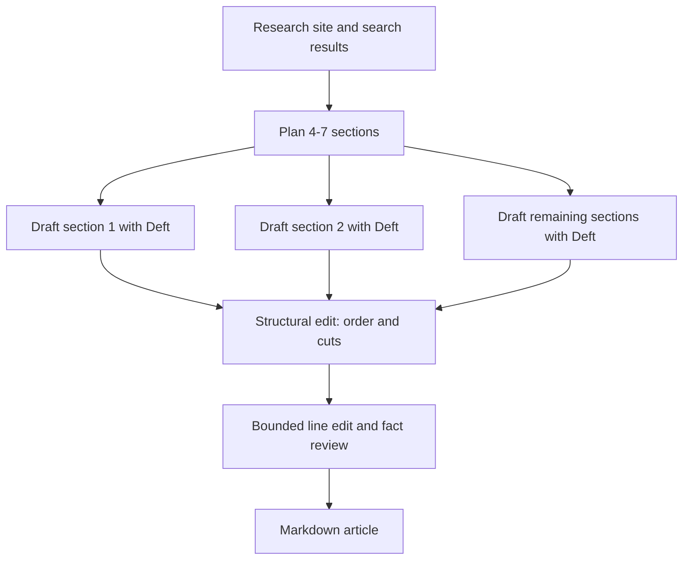

# Deft SEO Agent

An open-source agent that researches a site and a topic, plans an SEO/GEO-friendly long-form article, drafts its sections in parallel with [Deft](https://deftwriting.com), then applies constrained structural and factual review.

The important boundary is simple: **Deft writes all article prose.** The research and editor models can gather evidence, plan, cut, reorder, or propose small exact-match fixes; they do not replace the draft with model-written prose.

## Quickstart

Requires Node.js 20 or newer and your own API keys:

- `OPENROUTER_API_KEY` for research, planning, and constrained review
- `DEFT_API_KEY` for section drafting through Deft's public API ([create or manage a key](https://deftwriting.com/developers))

```bash
git clone https://github.com/DeftWriting/seo-agent.git
cd seo-agent
npm install
export OPENROUTER_API_KEY="..."
export DEFT_API_KEY="deft_live_..."
npm run dev -- --url https://example.com --topic "A practical guide to the topic"
```

The finished Markdown file is written to the current directory by default. Use `--out article.md` to choose a path.

After `npm run build`, the same command is available as:

```bash
node dist/cli.js --url https://example.com --topic "Your topic" --out article.md
```

## Local web UI

The repository also includes a tiny framework-free local interface:

```bash
npm run serve
```

Open [http://localhost:4173](http://localhost:4173). The local Node process runs the workflow and streams progress to the page with server-sent events. Keys stay in the process environment and are never sent to or stored by the browser.

## Workflow



The planner chooses four to seven sections, usually targeting roughly 500 words each. Draft requests are independent, self-contained full-document prompts because the public Deft API performs its own outline preprocessing.

## CLI options

```text
seo-agent --url <website> --topic <topic> [options]

--out <path>        Output Markdown path (default: a title-based filename)
--max-pages <n>     Maximum site pages to inspect (default: 12)
--concurrency <n>   Concurrent Deft section drafts (default: 4)
--thinking <level>  Deft thinking level: smarter or faster (default: smarter)
--json              Emit newline-delimited JSON progress to stdout
--help              Show help

seo-agent serve [--port <n>]
```

Optional environment variables:

- `DEFT_API_BASE_URL` — override `https://deftwriting.com` for local or beta testing
- `SEO_AGENT_OPENROUTER_MODEL` — override the default OpenRouter model
- `SEO_AGENT_PORT` — default local UI port

## Cost and network access

Each run uses OpenRouter web search and model calls plus several billable Deft API generations. Cost varies with source material, section count, models, and output length. The hosted version is available at [deftwriting.com/seo-agent](https://deftwriting.com/seo-agent).

The crawler accepts public HTTP(S) websites only. It validates redirects and rejects local, private, link-local, multicast, and reserved network targets. This is defense in depth for a local tool; review the code before exposing it to an untrusted network.

## Development

```bash
npm test
npm run typecheck
npm run build
```

The canonical published prompts are in [`src/core/prompts.ts`](src/core/prompts.ts). Hosted and open-source implementations are intentionally separate and may diverge, but should preserve the same workflow vocabulary and prose-author boundary.

## License

MIT
